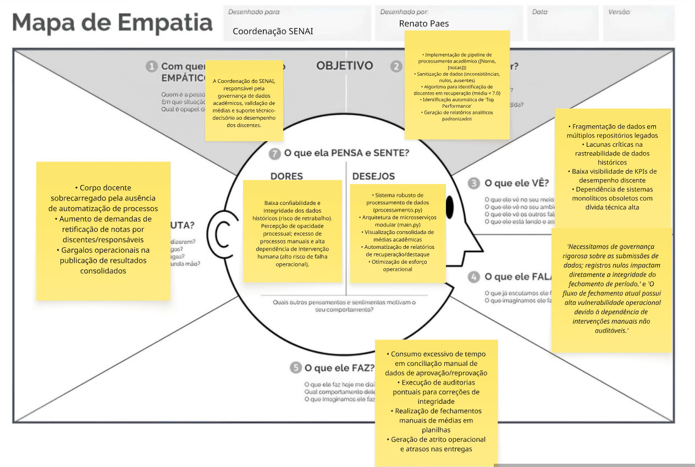
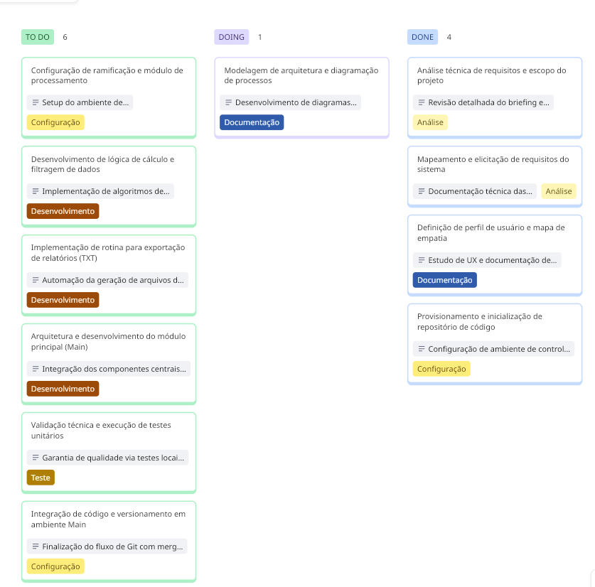

# Projeto de Análise Acadêmica - Metodologias Ágeis (SENAI)

Este repositório apresenta o desenvolvimento de um sistema de automação para processamento de performance estudantil. O foco principal é a aplicação prática de conceitos de **Ciência de Dados** e **Gestão Ágil** para otimizar a validação de registros acadêmicos.

---

## Documentação de Negócio (Requisitos)

Abaixo, detalhamos as diretrizes técnicas que nortearam o desenvolvimento do software:

### Regras de Funcionamento (Business Rules)

- **Critério de Recuperação:** Estudantes com pontuação média inferior a **7.0** são classificados automaticamente.
- **Destaque da Turma:** O título de _Top Student_ é vinculado ao maior coeficiente de rendimento validado.

### Especificações do Sistema (RF & RNF)

| Categoria          | Descrição                                                                             |
| :----------------- | :------------------------------------------------------------------------------------ |
| **Input de Dados** | Leitura de estruturas complexas via listas e tuplas: `[("Nome", [notas])]`.           |
| **Sanitização**    | Identificação e tratamento de campos nulos ou corrompidos na origem.                  |
| **Cálculo**        | Processamento iterativo das médias aritméticas para cada registro.                    |
| **Relatório**      | Geração automática do arquivo `resultado.txt` com o consolidado da turma.             |
| **Modularização**  | Divisão do código entre lógica de engine (`processamento.py`) e execução (`main.py`). |
| **Versionamento**  | Fluxo de trabalho via Git utilizando branches de desenvolvimento e merge final.       |
| **Resiliência**    | Uso de blocos de tratamento de erros para evitar interrupções no runtime.             |

---

## Planejamento Estratégico

Para garantir que o software resolvesse problemas reais da coordenação, utilizamos técnicas de **Design Thinking** e **Gestão de Fluxo**.

### 1. Visão do Usuário (Mapa de Empatia)

Análise detalhada das necessidades operacionais e das dores enfrentadas no gerenciamento manual de notas.



### 2. Controle de Fluxo (Kanban Board)

Organização visual das tarefas para priorização de entregas e transparência no desenvolvimento.



---

## Estrutura do Output

O sistema gera um log de saída formatado da seguinte forma:

```text
=== RELATÓRIO FINAL DE DESEMPENHO ACADÊMICO ===

ALUNOS PROCESSADOS:
...
ALUNOS EM RECUPERAÇÃO:
...
TOP STUDENT:
...
ALUNOS COM INCONSISTÊNCIA DE DADOS:
...
```
